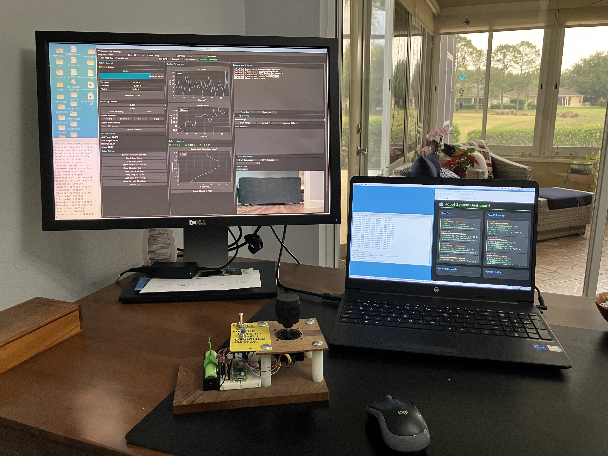
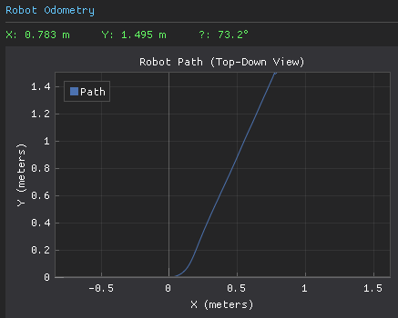

# Pure Pursuit

> This project is one of of a bunch of projects, all related to the [Raspibot](https://github.com/dblanding/raspibot) project. Locally, I keep them co-located under a common parent directory, in order facilitate import access to S.P.O.T. files such as *topics.py* (which contains the names of various MQTT topics). 
 
## Starts with a decent map
* I used MS Paint to clean up map.png (from OGmapper) and saved it as map_clean.png
* Then went through these steps:
    1. Convert to Binary Planning Map
        * Run it through `create_planning_map.py`
    2. Create Map Metadata File
        * `create_metadata.py`
    3. Create A Path Planner*
        * Run it using `uv run path_planner.py`
* It turns out that MS Paint insidiously converted my file to a **2.7x** higher resolution.
    * Use `check_res.py` to compare resolution before & after cleanup.
    * Paint resized it from 400×400 to 1079×1039.
* Pro tip for the future: Use these tools instead
    * GIMP (free, doesn't resize accidentally)
    * ImageMagick (`convert map.png -threshold 50% map_clean.png`)

## Fix map: Resize Back to 400×400
* `uv run resize_map.py`
* Repeat steps above:
    1. Recreate planning map with correct dimensions `uv run create_planning_map.py`
    2. Test path planning again `uv run path_planner.py`

## Inflation
* `check_inflation.py` generates a pair of images showing the effect of inflation

## Interactive Goal Selector
* **interactive_planner.py** is a *front-end* for path_planner.py that makes it easy to pick valid start/goal points by clicking on a map. Run it with `uv run interactive_planner.py`
* How to Use:
    1. Window opens showing your map (green = safe, black = obstacles)
    2. Click on green area → Sets start (blue circle)
    3. Click another green area → Sets goal (red circle) and automatically plans path
    4. Cyan line shows the path
    5. Click again → Plans new path with new start/goal
 ## Add *Path Smoothing*
* The A* path has jagged stair-step movements because it moves cell-by-cell on a grid. Smooothing removes unneccesary waypoints and draws straight lines where possible.
* Add smoothing to *path_planner.py*
 
## Now we're Ready to Drive! 🚗
* For starters, let's plan on operating in "Home Base" mode 🏠, where each trip will originate at pose (0, 0, 0)
* Architecture Overview:
```
┌─────────────────────────────────────────────┐
│  RobotNavigator                             │
│  - Manages missions                         │
│  - Plans paths                              │
│  - Coordinates return to home               │
└─────────────────┬───────────────────────────┘
                  │
        ┌─────────┴─────────┐
        │                   │
┌───────▼────────┐  ┌───────▼────────┐
│ Path Planner   │  │ Path Follower  │
│  (on Laptop)   │  │  (on laptop)   │
└────────────────┘  └───────┬────────┘
                            │
                    ┌───────▼────────┐
                    │  Motor Control │
                    │   (on Robot)   │
                    └────────────────┘
```
* Create files:
    * *path_follower.py* converts waypoints into velocity commands
    * *robot_navigator.py* high-level mission controller
    * *motor_control.py* runs (as a service) on Raspberry Pi - sends commands (lin_vel, ang_vel) via serial bus to Pico.
        * Pico receives commands from 2 sources and must decide between them:
            1. joystick commands (teleop) - higher priority
            2. motor_control (autonomous) - when joystick is switched off

## Pause to consider how this will integrate into my existing robot control system.

* My setup includes the following:
    * An onboard mqtt broker that publishes (currently) both lidar scans and pose.
    * I have a ssh connected GUI for monitoring and stopping and starting services
    * A web-based MQTT monitor
    * 2 ways to drive motors:
        1. A joystick control (connected via BLE) in teleop mode 
        2. Robot accepts MQTT drive commands with the format: (lin_spd, ang_spd)

## Using the interactive_planner
* Initial tests were based on planning paths from the robot's home position to a remote location.
* When I set up to make a run:
    1. I place the robot *precisely* in its "Home" pose (the blue dot in my interactive map)
    2. I start the odometer service, which resets the pose to (0, 0, 0).
    3. I start the motor_control service.
    4. I start path_follower with a path that is intended to take take the robot in the X direction.
* But surprisingly, the robot makes a hard left turn then proceeds straight in an oblique direction.



* Come to find out the Path planner uses MAP coordinates where (0, 0) is the lower-left corner of the map
* Whereas my robot is working in ODOMETRY coordinates
* Those Coordinate systems don't match!
* What's the best way to reconcile this mismatch which will provide a solid foundation for the future?

## It's time to think through a Clean Robotics Architecture
* We're going to build a ROS-like architecture, but without ROS

    * What we're borrowing from ROS (the good ideas):

        - ✅ Separation of odometry vs. localization
        - ✅ Coordinate frame concepts (map vs. odom)
        - ✅ initialpose message pattern
        - ✅ Modular programs communicating via MQTT (like ROS nodes via topics)

    * What we're NOT using:

        - ❌ ROS nodes, roslaunch, roscore
        - ❌ ROS tf2 transform library
        - ❌ ROS message types (.msg files)
        - ❌ ROS-specific terminology in your code

* In our new clean architecture, we will have Programs (not "nodes"):
```
odometry.py          → Tracks wheel movement (odom frame)
localization.py      → Figures out position on map (map frame)
path_planner.py      → Creates paths in map coordinates
path_follower.py     → Follows paths using localized position
motor_controller.py  → Low-level motor control
```

* Whereas ROS uses these 3 coordinate frames:
    1. Map frame - Global, fixed coordinate system
        * Origin at map corner or some fixed point
        * Where landmarks, walls, goals exist
        * Never changes

    2. Odom frame - Local, continuous coordinate system  
        * Origin where robot started (or last reset)
        * Tracks relative motion from encoders/IMU
        * Drifts over time but smooth

    3. Base_link frame - Robot's body
        * Origin at robot center
        * Moves with the robot

* We will refer to them this way (and we won't be using ROS tf):
    1. Map frame:    Global coordinates (your map_metadata.json defines this)
    2. Odom frame:   Local coordinates (where odometry starts at 0,0,0)
    3. Robot frame:  Robot's perspective (forward = +X in robot's view)

* In ROS, Transform is used to translate from one coordinate frame to another, whereas we will use LOCALIZATION
```
map → odom → base_link
    ↑
    └─ This transform comes from LOCALIZATION
```

* For Communication between programs:
    * We will use MQTT topics (not the same as ROS topics, but same idea)
    * We will use JSON messages (not ROS .msg types)

## Implementing the new architecture:

#### Phase 1 (this week): Simple localization
```
# localization.py - Version 1.0 (no particle filter yet)
# Just transforms odometry to map frame using initial pose
```
* This gives you:

    Proper architecture
    Odometry stays clean (always starts at 0,0,0)
    Easy to add particle filter later
    Only ~50 lines of code

#### Phase 2 (later): Add particle filter
```
# localization.py - Version 2.0
# Adds particle filter that uses lidar to correct drift
```
## Fixing some broken path planning programs
* The first hurdle was to discover and fix a problem with the latest version of interactive_planner.py (interactive_planner2.py).
    * It didn't record user poinht selection, nor did it display a path. So I checked earlier versions.
    * The first version (interactive_planner0.py) worked to allow the user to pick a start and end point, and would display the path found, but wouldn't save the path to file.
    * The 2nd version (interactive_planner1.py) fixed this problem and was fully functional.
* The 2nd hurdle was that the stored path was wrong. The Y values found by the path_planner were wrong. They increased from top to bottom of the image. The cause was failure to invert the Y values when converting from map coordinates to world and vice-versa. Once this was discovered and fixed, it became possible to use the full workflow from path planning to robot driving.

## Workflow with the new Architecture
0. With the robot powered up and parked in its Home position:
1. Start the odometer service on the robot
2. Start the motor_control.py program on the robot. (It is not currently set up as a service.)
3. ON the laptop, `uv run localization.py`
4. Set the initial pose by running this in a terminal: `mosquitto_pub -h raspibot.local -t 'robot/initialpose' -m '{"x": 0.7, "y": 2.6, "h": 0.0}'`
5. On the laptop, `uv run path_follower.py --path-file planned_path.json`

Reaching this goal was an excellent achivement, but as I stated in the beginning, this all starts with having a decent map, and this is where it became clear to me that the map I have been using is about 2/3 of its proper scale. Watching the robot execute a path looked a bit like watching someone with extra-large hands put on a pair of extra small-gloves.

So we're going to cap this off right here and I am going to revisit the task of making a **decent map**.
