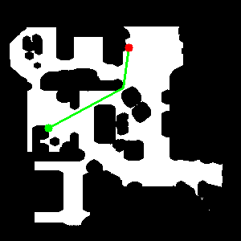

# Pure Pursuit

> This project is one of of a bunch of projects, all related to the [Raspibot](https://github.com/dblanding/raspibot) project. Locally, I keep them co-located under a common parent directory, in order facilitate import access to S.P.O.T. files such as *topics.py* (which contains the names of various MQTT topics). 
 
## Starts with a decent map
* I used Gimp to clean up a map (made with pose-graph_SLAM) and saved it as map_clean.png
    * The process of cleaning up the map in Gimp somehow changed my 300x300 file to 600x600, so I used resize_map.py to change it back to 300x300 size.
* Then go through these steps:
    1. Create Binary Planning Map: `uv run create_planning_map.py` to create:
        * `map_binary.png`
        * `map_inflation_viz.png`
        * `map_planning.png`
    2. Create Map Metadata File
        * Run `python create_metadata.py`
    3. Create A Path Planner*
        * Test it by running `uv run path_planner.py`
        ```
        ============================================================
        A* PATH PLANNER
        ============================================================
        ✅ Loaded map: (300, 300)
           Free cells: 26436 (29.4%)
           Resolution: 0.05m/cell
           Origin: (-3.0, -7.0)

        🎯 Planning path:
           Start: (0.00, 0.00) -> grid (159, 60)
           Goal:  (5.00, 5.00) -> grid (59, 160)
        ❌ Start position is not valid/free!

        ❌ Path planning failed!
           Check that start and goal positions are valid and reachable
        ```
        * Edited map_planning.png (using Gimp) and erased the offending (black) pixel.
        * Ran it again: `uv run path_planner.py`
        ```
        A* PATH PLANNER
        ============================================================
        ✅ Loaded map: (300, 300)
           Free cells: 26437 (29.4%)
           Resolution: 0.05m/cell
           Origin: (-3.0, -7.0)

        🎯 Planning path:
           Start: (0.00, 0.00) -> grid (159, 60)
           Goal:  (5.00, 5.00) -> grid (59, 160)
        ✅ Path found! Explored 4118 nodes
           Path length: 144 waypoints, 8.33m
           Raw path: 144 waypoints
           Reduced from 144 to 3 waypoints
           Smoothed: 3 waypoints

        📍 Waypoints (showing sample):
             0: (  0.00,   0.00)
             1: (  4.65,   2.50)
             2: (  5.00,   5.00)
        ✅ Saved path to planned_path.json
        ✅ Saved visualization to path_visualization.png

        ✅ Path planning complete!
           Waypoints: 3
           Distance: 7.80m
           Path file: planned_path.json
           Visualization: path_visualization.png

        💡 Next step: Run path follower
           python3 path_follower.py --path-file planned_path.json
        ```
        
        
        * The path planner came up with a path to a random goal. So far so good.
 
## But before we can start to drive, 🚗 
* Let's plan to operate in "Home Base" mode 🏠, where each trip will originate at pose (0, 0, 0)
* Next, consider how those motor commands will get to the robot
* Here's an Overview of our planned Architecture:
```
┌─────────────────────────────────────────────┐
│  RobotNavigator                             │
│  - Manages missions                         │
│  - Plans paths                              │
│  - Coordinates return to home               │
└─────────────────┬───────────────────────────┘
                  │
        ┌─────────┴─────────┐
        │                   │
┌───────▼────────┐  ┌───────▼────────┐
│ Path Planner   │  │ Path Follower  │
│  (on Laptop)   │  │  (on laptop)   │
└────────────────┘  └───────┬────────┘
                            │
                    ┌───────▼────────┐
                    │  Motor Control │
                    │   (on Robot)   │
                    └────────────────┘
```
* These files will each play a part in the process of moving from start to goal:
    * *robot_navigator.py* high-level mission controller
    * *path_planner.py* plans a route around any obstacles from start to goal -> delivers the waypoints
    * *path_follower.py* converts waypoints into velocity commands
    * *motor_control.py* runs (as a service) on Raspberry Pi - receives waypoints and sends commands (lin_vel, ang_vel) via serial bus to Pico.
        * Pico receives commands from 2 sources and must decide between them:
            1. joystick commands (teleop) - higher priority
            2. motor_control (autonomous) - when joystick is switched off

## Interactive Goal Selector
* The convenience function, **interactive_goal selector.py** is a *front-end* for path_planner.py that makes it easy to pick valid start/goal points by clicking on a map. Run it with `uv run interactive_goal_selector.py`
* Here's how it works:
    1. Window opens showing your map (green = safe, black = obstacles)
    2. Click on green area → Sets start point (blue circle)
    3. Click another green area → Sets goal point (red circle) and automatically plans path
    4. Path is displayed as a cyan line in file `path_visualization.png`
        * The waypoints (along the path) are saved to the file `planned_path.json`
    5. Click again → Plans a new path with new start/goal
 ### Add *Path Smoothing*
* The A* path has jagged, stair-step shape because it moves cell-by-cell on a grid. Smooothing removes unneccesary waypoints and draws straight lines where possible.
* Add smoothing to *path_planner.py*

### Alright, already! Let's run this. Here are the steps.

0. Plan a trip with the interactive planner.
1. Park the robot in its Home position and turn it on.
2. Start the odometer service on the robot
4. Start the motor service on the robot.
5. Run path follower on the laptop.

## Interactive Waypoint Selector

* When the robot drives along the path from start to finish, the A* algorithm hugs along any obstacles along the way. If you were driving a car through a narrow alley or tight spot, wouldn't you prefer a path half way between obstacles on the right and those on the left?
* The *interactive wp_selector.py* program makes it possible to do this. It also addresses a couple of other issues as well.
    * The map is much larger (with a size that is easy to set).
    * The path is no longer limited to just 2 points (start and goal), but can be defined by an unlimited number of points.
* Here's how it works:
    1. Click a first point 
    2. click a series of additional points defining the desired path
    3. After specifying the final point, press 'F' to mark the last clicked point as the final waypoint and plan path.

