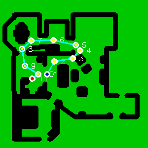
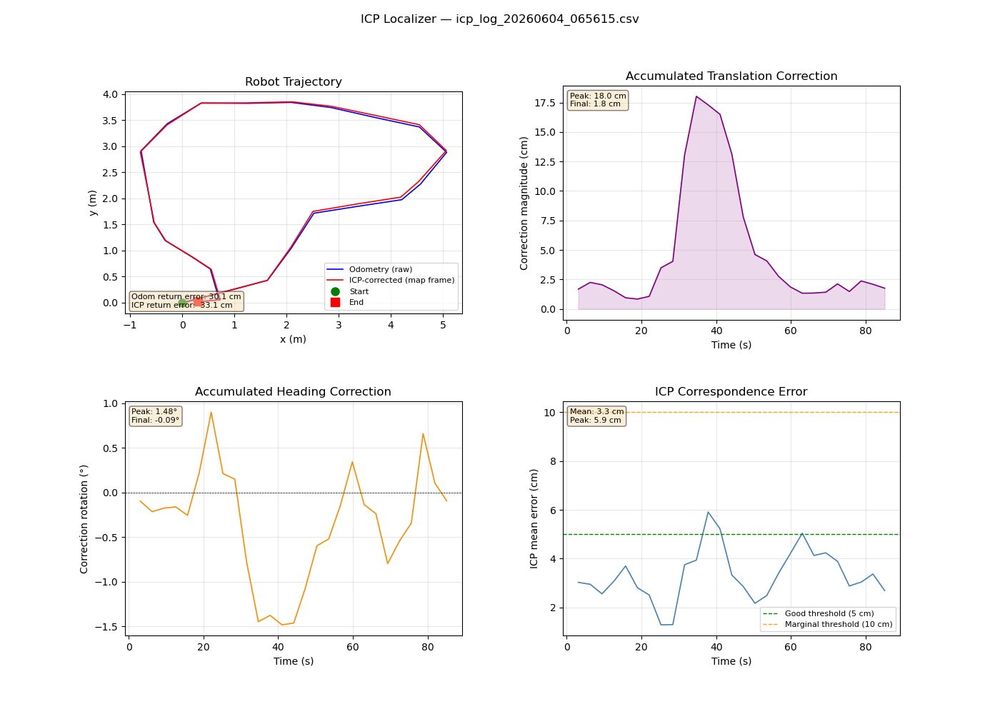
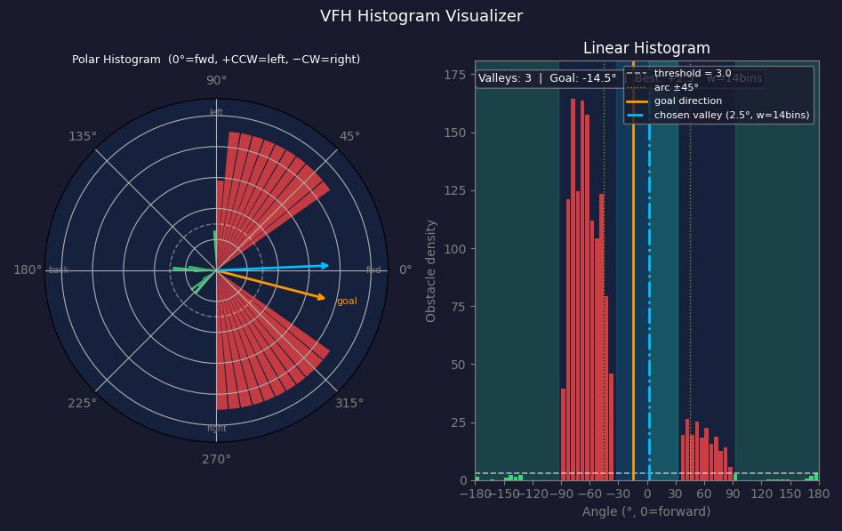

# Pure Pursuit: The geometric path-tracking algorithm that allows autonomous mobile robots to follow a predefined path smoothly.

> This project is one of of several projects, all related to the [Raspibot](https://github.com/dblanding/raspibot) project. Locally, I keep them co-located within a common parent directory, in order to facilitate import access to S.P.O.T. files such as *topics.py* (which contains the names of various MQTT topics). 
 
## Starts with a decent map
* I used Gimp to clean up a map (made with pose-graph_SLAM) and saved it as map_clean.png
    * The process of cleaning up the map in Gimp somehow changed my 300x300 file to 600x600, so I used resize_map.py to change it back to 300x300 size.
* Then go through these steps:
    1. Create Binary Planning Map: `uv run create_planning_map.py` to create:
        * `map_binary.png`
        * `map_inflation_viz.png`
        * `map_planning.png`
    2. Create file *map_metadata.json*
        * Run `python create_metadata.py`
    3. Create A* Path Planner
        * Test it by running `uv run path_planner.py`
        ```
        ============================================================
        A* PATH PLANNER
        ============================================================
        ✅ Loaded map: (300, 300)
           Free cells: 26436 (29.4%)
           Resolution: 0.05m/cell
           Origin: (-3.0, -7.0)

        🎯 Planning path:
           Start: (0.00, 0.00) -> grid (159, 60)
           Goal:  (5.00, 5.00) -> grid (59, 160)
        ❌ Start position is not valid/free!

        ❌ Path planning failed!
           Check that start and goal positions are valid and reachable
        ```
        * Edited map_planning.png (using Gimp) and erased the offending (black) pixel.
        * Ran it again: `uv run path_planner.py`
        ```
        A* PATH PLANNER
        ============================================================
        ✅ Loaded map: (300, 300)
           Free cells: 26437 (29.4%)
           Resolution: 0.05m/cell
           Origin: (-3.0, -7.0)

        🎯 Planning path:
           Start: (0.00, 0.00) -> grid (159, 60)
           Goal:  (5.00, 5.00) -> grid (59, 160)
        ✅ Path found! Explored 4118 nodes
           Path length: 144 waypoints, 8.33m
           Raw path: 144 waypoints
           Reduced from 144 to 3 waypoints
           Smoothed: 3 waypoints

        📍 Waypoints (showing sample):
             0: (  0.00,   0.00)
             1: (  4.65,   2.50)
             2: (  5.00,   5.00)
        ✅ Saved path to planned_path.json
        ✅ Saved visualization to path_visualization.png

        ✅ Path planning complete!
           Waypoints: 3
           Distance: 7.80m
           Path file: planned_path.json
           Visualization: path_visualization.png

        💡 Next step: Run path follower
           python3 path_follower.py --path-file planned_path.json
        ```
        
        
        * The path planner came up with a path to a random goal. So far so good.
 
## But before we can start to drive, 🚗 
* Let's plan to operate in "Home Base" mode 🏠, where each trip will originate at pose (0, 0, 0)
* Next, consider how those motor commands will get to the robot
* Here's an Overview of our planned Architecture:
```
┌─────────────────────────────────────────────┐
│  RobotNavigator                             │
│  - Manages missions                         │
│  - Plans paths                              │
│  - Coordinates return to home               │
└─────────────────┬───────────────────────────┘
                  │
        ┌─────────┴─────────┐
        │                   │
┌───────▼────────┐  ┌───────▼────────┐
│ Path Planner   │  │ Path Follower  │
│  (on Laptop)   │  │  (on laptop)   │
└────────────────┘  └───────┬────────┘
                            │
                    ┌───────▼────────┐
                    │  Motor Control │
                    │   (on Robot)   │
                    └────────────────┘
```
* These files will each play a part in the process of moving from start to goal:
    * *robot_navigator.py* high-level mission controller (Not yet implemented)
    * *path_planner.py* plans a route around any obstacles from start to goal -> saves the waypoints to file *planned_path.json*
    * *path_follower.py* converts waypoints into velocity commands
    * *motor_control.py* runs (as a service) on Raspberry Pi - receives velocity commands (lin_vel, ang_vel) and relays to Pico via serial bus.
        * Pico receives commands from 2 sources and must decide between them:
            1. joystick commands (teleop) - higher priority
            2. motor_control (autonomous) - when joystick is switched off

## Interactive Goal Selector
* The convenience function, **interactive_goal_selector.py** is a *front-end* for path_planner.py that makes it easy to pick valid start/goal points by clicking on a map. Run it with `uv run interactive_goal_selector.py`
* Here's how it works:
    1. Window opens showing your map (green = safe, black = obstacles)
    2. Click on green area → Sets first waypoint (blue circle)
    3. Click another green area → Sets goal point (red circle) and automatically plans path
    4. Path is displayed as a cyan line in file `path_visualization.png`
        * The waypoints (along the path) are saved to the file `planned_path.json`
    5. Click again → Plans a new path with new start/goal
 ### Add *Path Smoothing*
* The A* path has jagged, stair-step shape because it moves cell-by-cell on a grid. Smooothing removes unneccesary waypoints and draws straight lines where possible.
* Add smoothing to *path_planner.py*

### Here is the order of steps in driving a trip.

1. Park the robot in its Home position and turn it on.
2. Start the odometer service on the robot
3. The motor_control service on the robot is already running.
4. Run path follower on the laptop: `uv run path_follower.py`

## Interactive Waypoint Selector

* When the robot drives along the path from start to finish, the A* algorithm hugs along any obstacles along the way. If you were driving a car through a narrow alley or tight spot, wouldn't you prefer a path half way between obstacles on the right and those on the left?
* The **interactive_wp_selector.py** program makes it possible to do this. It also addresses a couple of other issues as well.
    * The map display is much larger (with a size that is easy to set).
    * The path is no longer limited to just 2 points (start and goal), but can be defined by any number of points.
* Here's how it works:
    1. Click a first point 
    2. Click a sequence of additional points defining the desired path
    3. After specifying the final point, press 'F' to mark the last clicked point as the final waypoint. The planned path is stored in *planned_path.json*.

## Improve pose accuracy with a better map and ICP Localization

Although the Optical Tracking Odometry Sensor (OTOS) does a remarkably good job of determining the robot's pose, it is not perfect and any errors, however small, tend to accumulate and grow over time. This inaccuracy can become signficant over long runs. One way to obtain more accurate pose information is if the robot can "look at its environment" and compare what it sees with what it ought to be seeing based on an accurate map. This technique is called *ICP Localization*. It basically compares a 'source' point cloud of a laser scan with a 'target' point cloud from an accurate map and tries to get them to line up as perfectly as possible. The amount that the source points need to be shifted is a measure of the odometer drift.

In order to implement this, we will need to add 2 new things:
1. A more accurate survey map
    * Use some basic surveying tools and *build_map.py*. This program actually produces several .png map files matching map_metadata.json exactly, one of which is a display that shows the new map overlaid on the original "approximate" map, making it easy to check progress as the new map is being built.
2. A program *icp_localizer.py* that can find the robot's accurate location on the map.

### Overview of how ICP Localization works to correct odometer drift

Iterative Closest Point (ICP) localization corrects odometer drift by aligning real-time sensor data (like a LiDAR scan) with a point cloud from a pre-existing map. By calculating the exact shift needed to match the sensor data to the environment, it overrides the accumulated, inaccurate dead-reckoning of the odometer. 

The correction process happens in a structured, iterative loop:

1. Motion Prediction (The Odometry)
    - When the robot moves, the OTOS publishes pose under Topic.ODOM_POSE. Over time, small sensor inaccuracies compound into odometer drift, meaning the vehicle thinks it is somewhere it is not. 
2. Initial Guess
   - The algorithm takes the ODOM_POSE estimate as its starting point or "initial guess". This rough position is used to pull up the correct section of the map. 
3. Point Cloud Association
   - Every few seconds, a LiDAR scan is captured and converted to a new "point cloud." ICP searches for the nearest points between this new scan and the point cloud from the reference map to find corresponding pairs. 
4. Transformation and Error Minimization
   - ICP calculates the geometric transformation (rotation and translation) needed to snap the new scan onto the reference map so that the distance between paired points is as close to zero as possible.
5. Iteration and Correction
   - Because the initial guess is only approximate, the association and transformation steps need to be repeated over and over in micro-adjustments. The algorithm is said to have converged once the distance between the point pairs drops below a specified threshold. 
6. Correcting the Drift
    - The computed corrections (dx, dy and dθ) of the ICP pose w/r/t the odom pose can then be applied to the corresponding components of odom pose, improving the estimate of the vehicle's true pose. By applying these corrections gradually, "jumps" in the pose value can be avoided. The improved pose is published as Topics.POSE.

Adding the icp_localizer node requires a change in the previous flow of mqtt messages. The path_follower node will no longer subscribe to (Topics.ODOM_POSE) but will subscribe to (Topics.POSE) instead.

odometer → (Topics.ODOM_POSE) → icp_localizer → (Topics.POSE) → path_follower

## Making a typical run

0. Use interactive_wp_selector to plan a path



1. Park the robot in its Home position and turn it on.
2. Start the scanner
3. Start (& reset) robot odometer service (allow several seconds to calibrate)
4. Start icp_localizer on the laptop
5. Run path_follower on the laptop: `uv run path_follower.py` (to completion)
6. Stop scanner, odometer, and localizer
7. Run plot_icp_log.py to display run performance



## Add Obstacle Avoidance

An *obstacle_avoidance* node acts as a **collision safety net** which will kick in and apply the brakes if the scanner detects an object in its path close ahead. The path_follower node will no longer publish Topics.MOTOR_CMD messages directly to the motor_control node, but will instead publish Topics.NAV_CMD messages to the new obstacle_avoidance node, which will in turn re-publish them on Topics.MOTOR_CMD except when an imminent crash is detected.

path_follower → (Topics.NAV_CMD) → obstacle_avoider → (Topics.MOTOR_CMD) → motor_control

### Startup order

1. icp_localizer.py      (as before)
2. obstacle_avoidance.py (new — start before path_follower)
3. path_follower.py      (as before)

## Evolve Obstacle Avoidance to steer through narrow gaps

Just steering along a path consisting of a series of pre-selected waypoints doesn't really qualify as being autonomous behavor, does it? As an experiment in autonomous behavior, I decided to expand the role of the Obstacle Avoidance node to go beyond just applying the brakes and actually take control of steering in tight quarters. When the robot needs to go through a tight gap between obstacles, it can get a little dicey if you have to do it "blindfolded". For this, I relied on the use of the VFH (Vector Field Histogram) algorithm. We have lidar, so let's use it to build a VFH of the environment, showing the gap between the obstacles as a "valley" between "2 hills" in the linear histogram.



In the figure above, the polar plot on the left is like a bird's-eye view of a robot proceeding along its local X-axis about to enter a narrow gap which is barely wide enough to allow it through. Driving a path straight to goal would not be successful. To get through the gap, the path_follower needs to temporarily relinquish steering control to the obstacle_avoider, until it gets through the gap. The algorithm is pretty simple: At the entrance, steer in place to align the robot with the center of the open channel, then proceed through the gap with zero steering. Upon exit, return control to the path_follower.

## Phase 2: Unmapped obstacle detection and logging

Teaching the robot to notice things that aren't in its survey map and report them in a form that can be added to build_map.py

Here's the concept. Every time the ICP localizer runs, it matches scan points against the known map. Points that match are the walls and fixed furniture on the survey map. But some points don't match — they land in empty space on the map. Right now those unmatched points are just ignored. In Phase 2, we collect them.

The pipeline would look like this:
* Collect — a new node *detect_obstacles.py* subscribes to Topics.LIDAR_SCAN and Topics.POSE. For each scan it transforms points to map coordinates and checks each one against survey_map.png. Points that fall in empty map pixels are "unmatched" — potential unknown obstacles.
* Filter — single unmatched points are usually noise (people walking through, scan artifacts). A point only becomes interesting if it appears consistently across multiple scans from different robot positions. This uses DBSCAN clustering — a standard algorithm in scikit-learn that groups nearby points into clusters and discards isolated outliers.
* Report — clusters that persist across enough scans get a bounding box fitted to them. The output is candidate draw_filled_rect() calls that can be pasted into build_map.py, with coordinates in the existing map frame.  Review them, decide which ones represent real furniture worth adding, and update the map.

### Workflow

1. Identify an area where an object of interest is located
2. Plan a waypoint loop around the object using interactive_wp_selector.py
3. Run the nodes below in the order shown:
    1. icp_localizer.py
    2. detect_obstacles.py
    3. obstacle_avoidance.py
    4. path_follower.py
4. Review the output of detect_obstacles and add object(s) to build_map.py
5. Run build_map.py to generate new maps

## Phase 3: Exploring Beyond the Known Map (Not yet implemented)

A "frontier" is the boundary between known free space and unknown space in an occupancy grid. The robot identifies frontiers, navigates to the nearest or most informative one, and maps as it goes. The [Pose-Graph SLAM](https://github.com/dblanding/pose-graph-SLAM) system demonstrated the ability to build maps while teleoperating the robot  — frontier exploration would drive that process autonomously.
